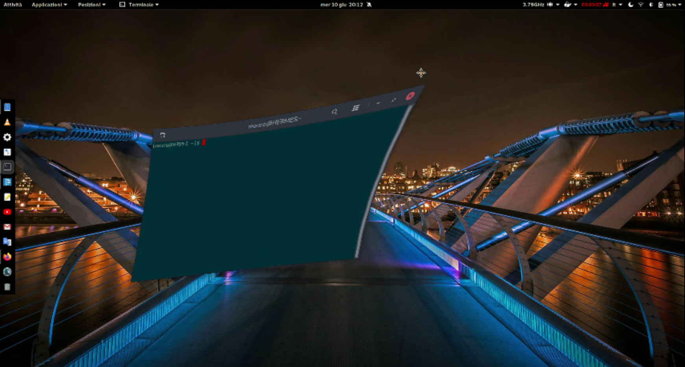

# Compiz windows effect for GNOME Shell

Compiz wobbly windows effect with libanimation engine.

## Prerequisite

The use of the "js engine" option NOT requires any external library, orherwise you need to install the LIBANIMATION library patched for Gnome Shell: [libanimation patched for Gnome Shell](https://github.com/hermes83/libanimation/) library.

## Installation

You can install this extension by visiting [the GNOME Shell Extensions page](https://extensions.gnome.org/extension/3210/compiz-windows-effect) for this extension.

## Video

You can see extension in action in this [video](https://youtu.be/G8bAVIB9A7A)

## Alternative

If you find this extension laggy, you can opts to use the alternative native extension by visiting [the GNOME Shell Extensions page](https://extensions.gnome.org/extension/2950/compiz-alike-windows-effect/).